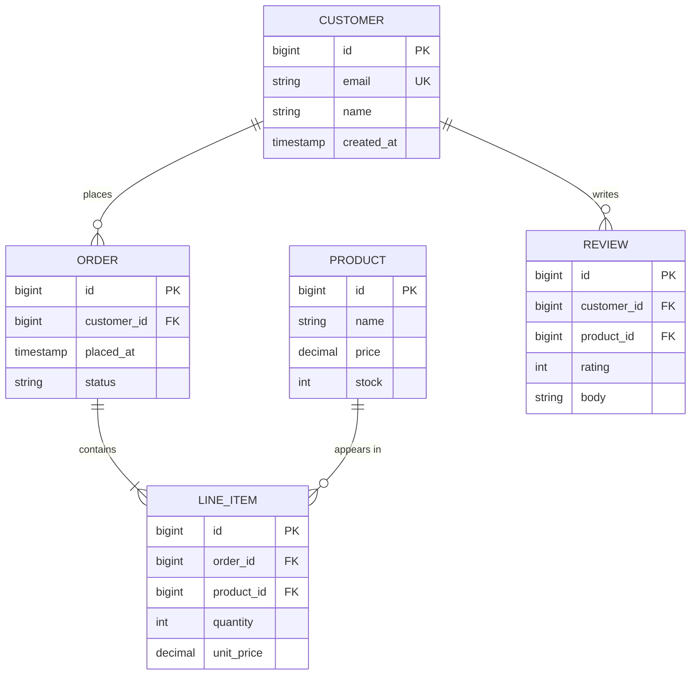

# Mermaid ER Diagram

`erDiagram` is rendered natively by mdterm as ASCII art — entity cards with
PK/FK badges and crow's-foot cardinality endpoints are drawn with
box-drawing characters, so the diagram stays crisp in every terminal
including the half-block fallback over SSH.

