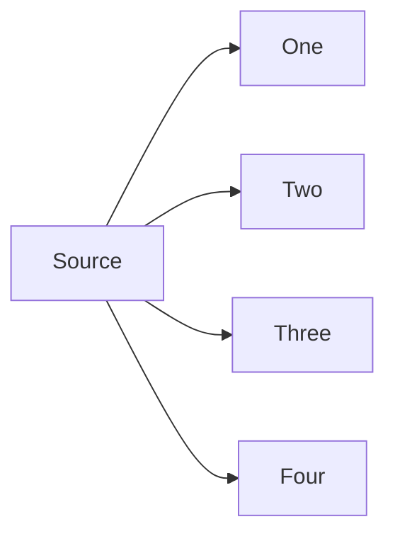
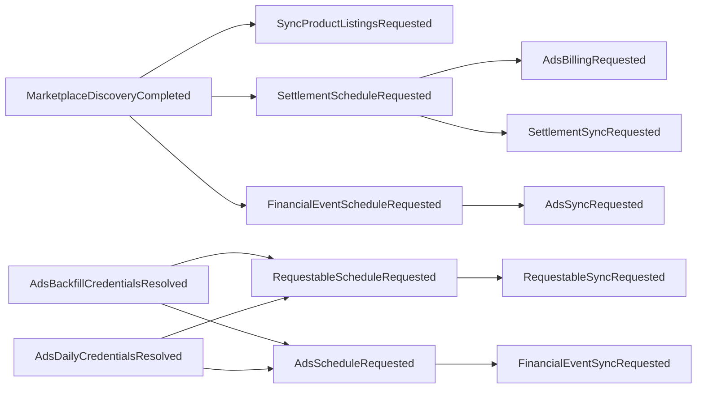

# Mermaid Routing Comparison

This file is intended for visually comparing LR edge routing before and after
the rounded per-edge lane work.

## Fan Out

```mermaid
graph LR
    A[Source] --> B[One]
    A --> C[Two]
    A --> D[Three]
    A --> E[Four]
```

## Cross Layer

```mermaid
graph LR
    Discovery[MarketplaceDiscoveryCompleted] --> Listings[SyncProductListingsRequested]
    Discovery --> Settlement[SettlementScheduleRequested]
    Discovery --> Finance[FinancialEventScheduleRequested]
    Backfill[AdsBackfillCredentialsResolved] --> Requestable[RequestableScheduleRequested]
    Backfill --> AdsSchedule[AdsScheduleRequested]
    Daily[AdsDailyCredentialsResolved] --> AdsSchedule
    Daily --> Requestable
    Settlement --> Billing[AdsBillingRequested]
    Settlement --> SettlementSync[SettlementSyncRequested]
    Requestable --> RequestableSync[RequestableSyncRequested]
    AdsSchedule --> FinancialSync[FinancialEventSyncRequested]
    Finance --> AdsSync[AdsSyncRequested]
```
