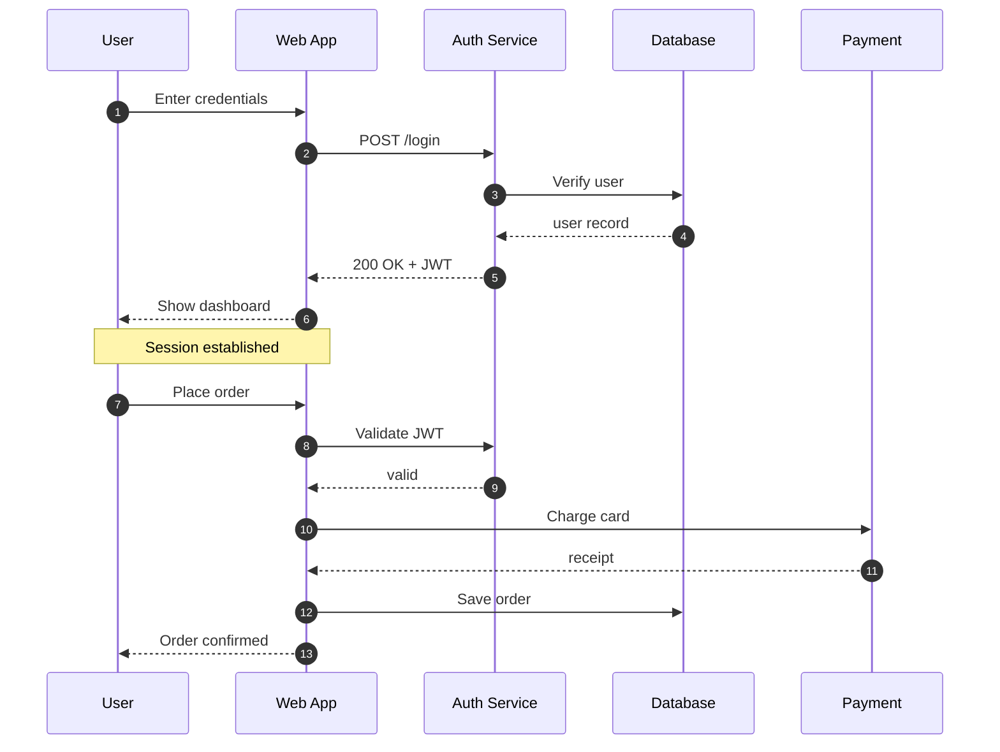

# Mermaid Sequence Diagram

Sequence diagrams are rendered natively by mdterm (lifelines, messages,
activations and notes drawn with box-drawing characters), so they stay crisp
and readable in every terminal — including the half-block fallback over SSH.

