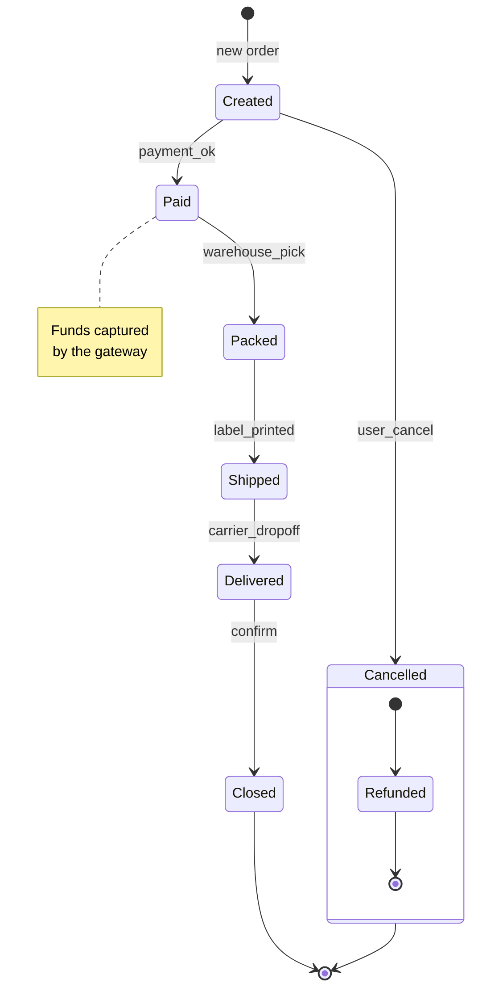

# Mermaid State Diagram (v2)

`stateDiagram-v2` is rendered natively by mdterm as ASCII art — states,
transitions, initial/final pseudo-states, fork/join bars, notes, and
composite (nested) states are drawn with box-drawing characters, so the
diagram stays crisp in every terminal including the half-block fallback
over SSH.

